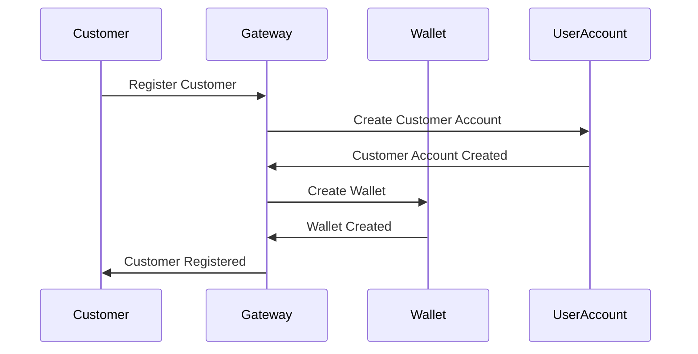
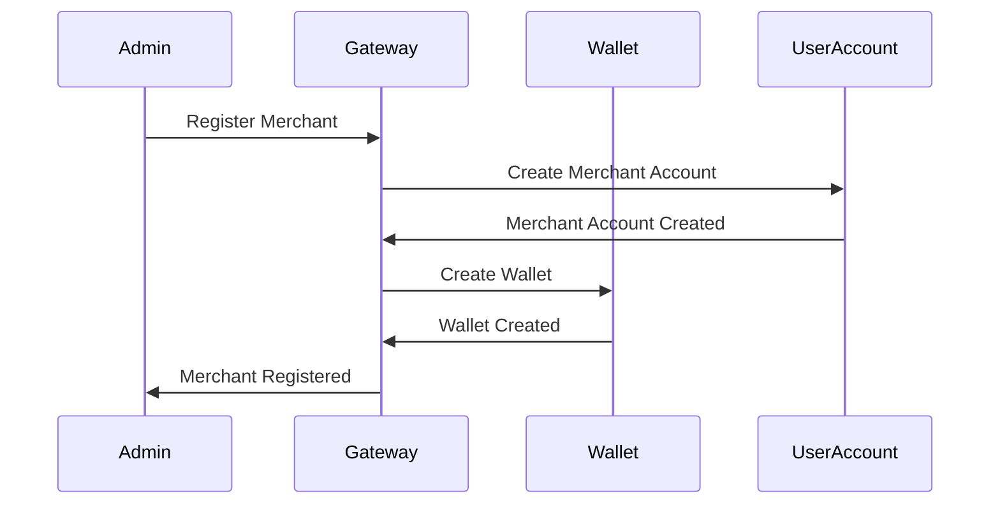
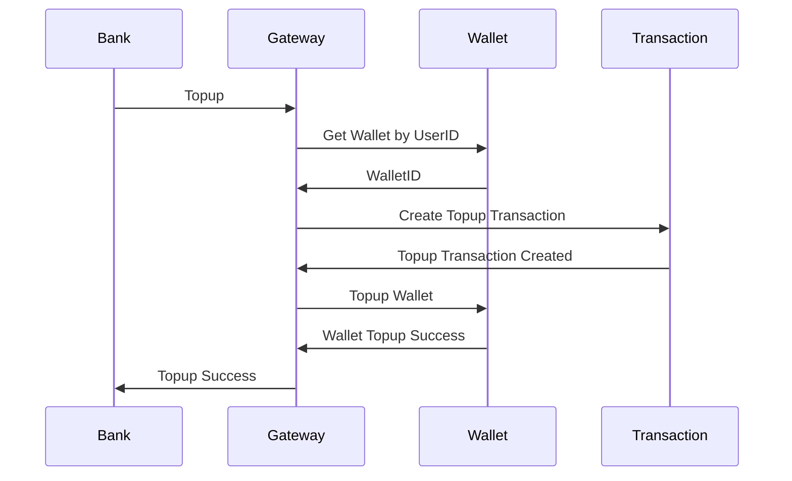
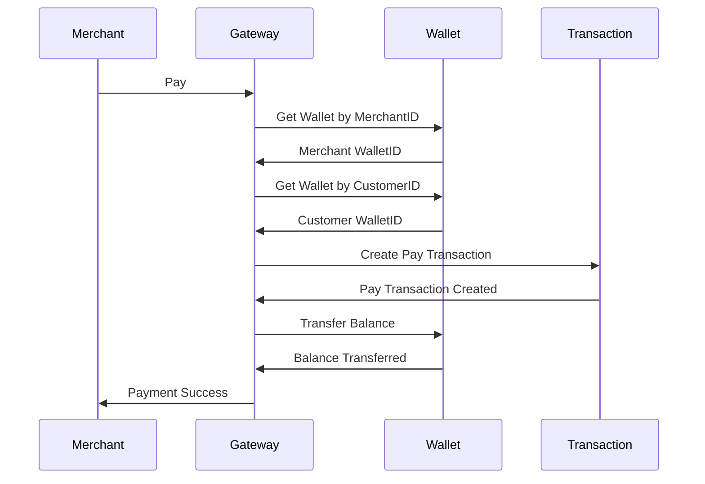
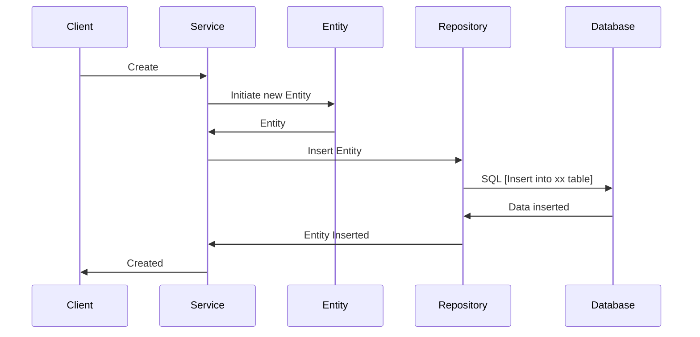
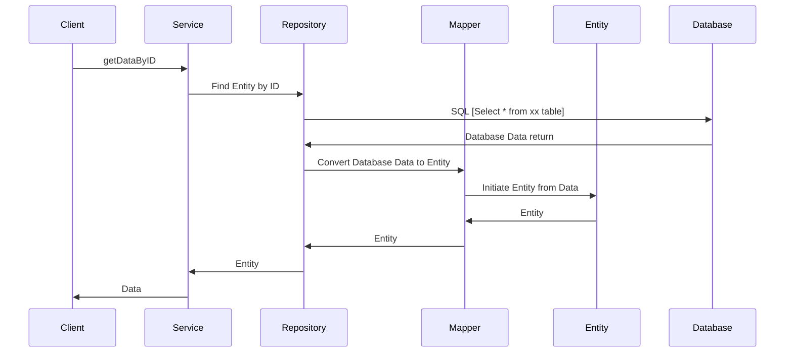

 # Seapay
 
Seapay is a fintech app consists of 4 different services
  - API gateway
    - API gateway service routes all requests to other services
  - User account
    - User account service takes care of user management: user creation, get user data, etc
  - Wallet
    - Wallet service handles all wallet functionalities: update balance, get balance, create wallet, etc
  - Transaction
    - Transaction service manage all transaction data

The project itself has 4 modules
 - seapay-api
   - a module that abstracts interface for all services
 - seapay-common
   - a module that groups all common functionalities used by all services
 - seapay-domain
   - the bussiness logic for all services goes here
 - seapay-monolith
   - an entry point of our monolithic app, including all handlers
  
 # How to use

 ### Dependencies
 ```
 brew cask install java
 ```

 ### How to build

 ```
 make all
 ```

 ### How to run
 ```
 make run
 ```
 
 # Logic Sequence Diagram
 This script can be shown as Sequence Diagram on `https://mermaidjs.github.io/mermaid-live-editor`

 ### Register Customer


### Register Merchant


### Topup


### Pay


 # Common Sequence Diagram

 ### Create Entity Flow


  ### Find Entity Flow

